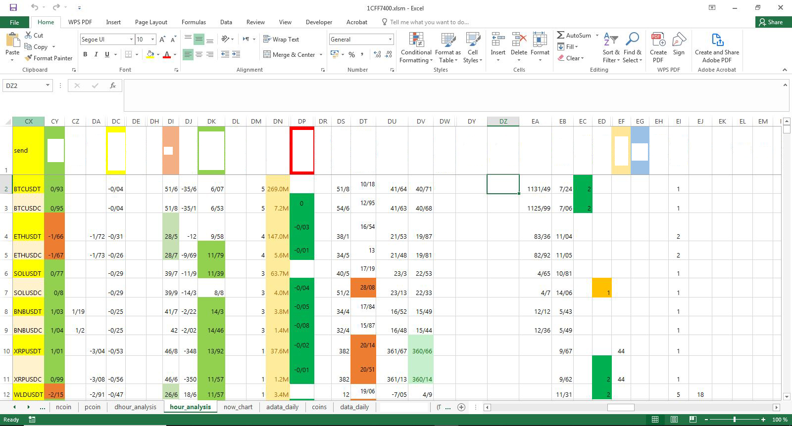
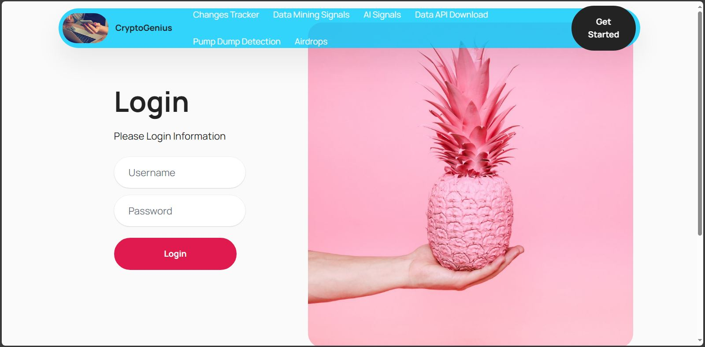
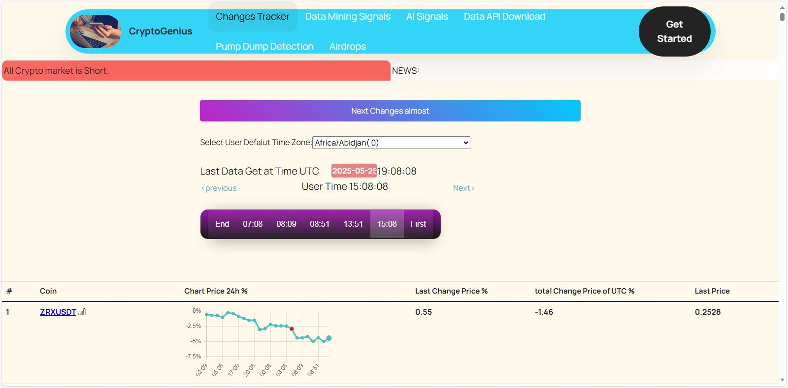
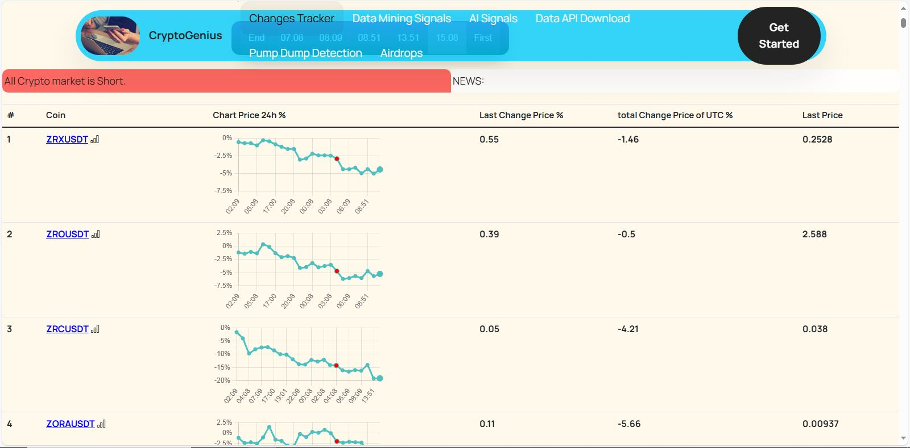
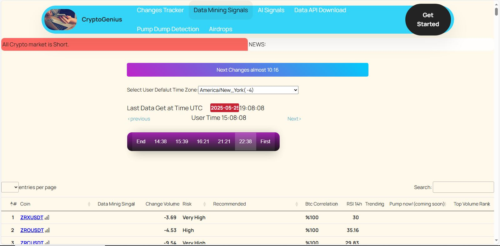
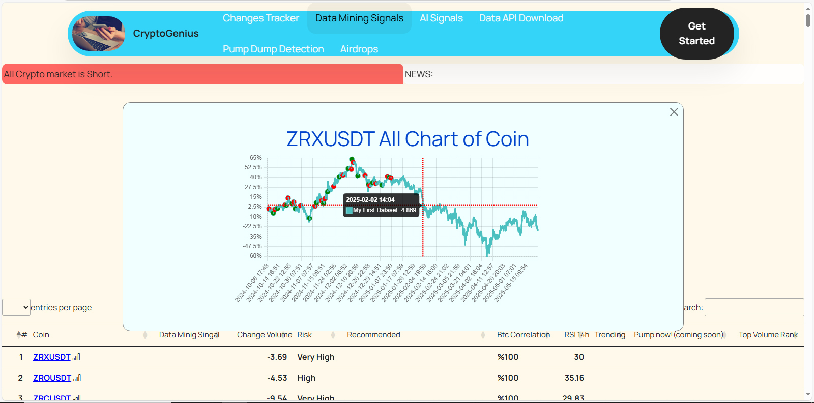

# 🚀 AI-Powered Cryptocurrency & Market Forecasting Platform (Startup Edition)
CryptoGenius is a commercial full-stack AI-powered forecasting and signal-generation platform for cryptocurrency markets. It also serves both as a **real-time intelligent assistant for traders** and as a **fully automated trading engine** powered by high-yield strategies. Built by a financial AI engineer and trader, this system combines deep learning, rule-based logic, and real-time data mining to deliver high-accuracy buy/sell signals and market insights. Includes automated data ingestion, technical and news-based feature engineering, and modular dashboards for traders and analysts. Originally developed in 2024–2025 as a commercial prototype. Seeking investment to expand into global markets and stock exchanges.

> ⚠️ This repository hosts a **demo snapshot** of a full-stack AI forecasting system.  
> Originally developed June 2024 – June 2025 and now paused, it showcases core pages, data pipelines, and database design.
> **The project is actively seeking investment** to resume development and expand into global markets.
> The live demo of the landing page is available online.

---

## 📝 Project Overview

A commercial-grade web platform leveraging data mining, deep learning, and real-time news signals to forecast 5–10-minute and 1-hour price movements in major cryptocurrencies (with stock-market support planned).  
Features a dynamic sidebar UI, automated data-extraction bot, hourly feature engineering, and a modular database—built end-to-end by an experienced AI engineer and trader.

---

## 💡 Market Need & Investment Opportunity

CryptoGenius was not originally designed as a startup — it began as a personal solution to a real and pressing challenge faced by many traders:  
How can one consistently identify profitable crypto opportunities before they occur, without being overwhelmed by noise, stress, or manual analysis?

As a trader entering the crypto markets, I found it difficult to manage real-time decisions with confidence.  
So I built a system that could automatically detect high-probability buy/sell signals, validate them against macro trends, and present only the most actionable insights.  
This system evolved into a full-stack AI-powered platform — now known as **CryptoGenius** — combining technical analysis, rule discovery, and expert oversight.

### 🔍 Real User Demand

The need for intelligent decision-support tools in trading is widespread and growing:

- Millions of traders seek **simplified, reliable, and automated guidance**.
- Most existing platforms are either too complex, too generic, or too expensive.
- Traders are willing to pay **$5–$10/month** for tools that genuinely improve their performance and reduce emotional decision-making.

CryptoGenius directly addresses this gap by offering:

- Real-time signal generation with **80–100% accuracy** (based on historical testing)
- A built-in expert layer using a **custom Fibonacci-based market direction formula**
- A user-friendly interface tailored to actual trading workflows
- Modular design for future expansion into other asset classes and exchanges

### 📈 Investment Potential

This project is currently **paused**, but fully documented and ready for expansion.  
It has already proven its value in real-world testing and personal use — and now seeks strategic investment to:

- Transform the prototype into a scalable SaaS product  
- Launch subscription-based access for retail and professional traders  
- Expand forecasting logic and symbol coverage  
- Integrate with exchanges and portfolio management tools

> 🚀 **CryptoGenius is actively seeking investment** to resume development and unlock its full commercial potential.

For more background on the original signal-testing environment and methodology, see the archived **DeepTSE** project on [GitHub](https://github.com/your-username/DeepTSE).

---

## 🚀 Why CryptoGenius Is Different

CryptoGenius is not just another AI startup — it's a hybrid decision-support system born directly from the trading floor.  
Unlike generic platforms built in isolation, this system was crafted by a trader deeply embedded in the crypto market, with hands-on experience using real tools, journals, and daily market updates.

During prototype testing, CryptoGenius achieved **100% signal accuracy** in sample runs — when paired with expert oversight and proper calibration.  
This is not a black-box AI; it's a **human–AI hybrid**, where machine learning discovers rules and patterns, and a seasoned expert validates macro trends using a custom Fibonacci-based formula.

> Think of it as **data-mined intelligence + expert logic = actionable crypto signals**.

Most platforms in this space offer fragmented features — one has good charts, another has decent alerts, another has basic automation.  
But none combine all the **best capabilities** into a single, trader-focused, intelligent system.  
CryptoGenius does exactly that — and adds **original, creative features** that no other product currently offers.

This is a platform built for real traders, by a real trader — not just a tech demo.  
It’s designed to simplify decision-making, reduce noise, and empower users with **practical, high-yield insights**.

> 💡 CryptoGenius is ready to scale — and it’s unlike anything else in the market.

---

## 🧪 From Excel Prototype to Full-Stack Platform

CryptoGenius began as a personal solution to a real challenge in crypto trading:  
How can one consistently detect high-probability opportunities before they occur — without being overwhelmed by noise, stress, or manual analysis?

As a financial market analyst and trader, I initially built a signal-testing environment in **Excel**, powered by:

- Advanced formulas and conditional logic  
- **VBA automation** for real-time updates  
- Over **20 specialized sheets**, each focused on a unique type of analysis (technical indicators, behavioral patterns, signal validation, etc.)  
- AI-assisted rule discovery based on observed data and expert feedback

This system helped me trade with confidence and minimal stress.  
Through extensive experimentation, I developed a hybrid strategy that achieved **80–100% accuracy** in sample runs — combining machine-discovered rules with a **human expert layer** that validates macro trends using a **custom Fibonacci-based formula** I personally developed.

Only signals aligned with the detected market direction are shown to the user, ensuring high precision and reduced false positives.

### 🔄 Why Move Beyond Excel?

While powerful, Excel quickly became a limiting environment for deeper experimentation — especially when testing complex strategies, validating outputs, and simulating real-time market behavior.  
So I decided to build a dedicated full-stack web-based platform.

This allowed me to:

- Run strategy tests more efficiently and enjoyably  
- Visualize signal outputs with greater clarity  
- Integrate real-time data feeds and dynamic dashboards  
- Create a scalable foundation for future automation and user interaction

> Writing this system as a full-stack web application was not just a technical upgrade — it was a strategic leap.  
> It transformed a personal tool into a professional-grade platform ready for broader use and investment.

CryptoGenius now offers a seamless environment for signal generation, trend analysis, and decision support — built from the ground up by someone who lives inside the market and understands the real needs of traders.

### 📸 Snapshot from the Original Excel Testbed

Below is a sample from the original Excel-based environment used to discover trading rules, validate signals, and simulate market behavior:

---

## ⏳ Timeline & Status

- **June 2024** – **June 2025**: Full UI, ETL bot, forecasting models, database schema implemented  
- **Status**: Demo snapshot published; core modules **implemented**; future enhancements **paused**  
- **Cost**: Operational cost ≈ 0 (automated data extraction & processing)  
- **Investment**: Seeking capital to resume development and expand to global exchanges

---

## 🔑 Core Modules & Pages

Below are the four main web pages currently designed and included in this demo:

### 1. **Landing Page**

   Introducing the platform, key metrics, and invitation to register.
     
   

### 📡 2. **Live Market Monitor**

   Hourly price charts and symbol metrics with historical overlays and trend tracking.
   
   ---
   
   
   #### 🕒 Real-Time Navigation & Symbol Insights
   
   The **Live Market Monitor** allows users to:

   - View all symbol charts simultaneously
   - Navigate across the current day or previous days  
   - Move forward/backward by hour to explore market conditions  
   - View all crypto trading symbols in one unified dashboard  
   - Access dynamic, professional-grade charts and technical metrics for each symbol  
   - Adjust the platform’s time zone based on their geographic location
   
   This page provides a complete snapshot of the market at any given hour — making it easy to analyze trends, compare signals, and prepare for upcoming trading windows.
   
   #### 🔴 Market Status & Directional Forecasting
   
   At the top of the page, a **red market status banner** displays the current macro trend.  
   This trend is determined by a proprietary **Fibonacci-based algorithm**, designed by the CryptoGenius team and validated by a **human crypto expert**.
   
   The expert monitors the charts 24/7 and updates the market direction **before major shifts occur**, ensuring users are informed ahead of time.
   
   On the chart, you’ll notice:
   
   - 🔴 Red markers: Bitcoin is turning bearish  
   - 🟢 Green markers: Bitcoin is turning bullish  
   
   Since most cryptocurrencies follow Bitcoin’s lead, the **market direction is essentially Bitcoin’s direction**.
   
   #### 🔄 Auto-Refresh & Expert Oversight
   
   This page automatically refreshes **5–10 minutes before each hourly trading frame begins**, ensuring users receive the latest data and signals in time.
   
   A team of expert analysts continuously monitors the charts and confirms directional changes **before they happen**, allowing users to confidently open **long or short positions**.
   
   > ✅ All symbol data, signals, and technical metrics are available in one place — designed for clarity, speed, and decision-making confidence.

### 🔔 3. **Signal Dashboard**

   Real-time buy/sell signals for each symbol—updated 5–10 minutes before each hourly candle close.
   
   ---
   

   #### 🧠 AI-Powered Signal Discovery
   
   This dashboard presents **hourly buy/sell signals** generated through advanced **AI-driven data mining**.  
   All crypto trading symbols are displayed on a single page, with dynamic charts and technical metrics for each.
   there
   
   Users can:
     
   - Monitor market direction changes and pump/dump events  
   - Receive actionable signals **before they occur** — typically 5–10 minutes before the next hourly trading frame  
   - See the **risk level** of each asset and adjust their leverage accordingly  
   - Access additional technical insights to support **confident and informed decision-making**
   - Access dynamic, professional-grade charts and technical metrics for each symbol
   
   #### 🔄 Auto-Refresh & Time Navigation

   This system is designed to help traders act **without hesitation**:
   
   - Signals are refreshed automatically before each hourly candle  
   - Market direction is monitored in real-time  
   - Users can open long or short positions based on clear, timely signals  
   - The dashboard includes all relevant data in one place — no need to switch tabs or tools

   Just like the **Live Market Monitor**, this dashboard includes:
   
   - **Automatic refresh** every 5–10 minutes to ensure users receive the latest signals  
   - **Time navigation controls** to move forward/backward across hours and days  
   - The ability to **click on any symbol** to view a **full-size, detailed chart** with overlays and technical indicators  
   - Time zone adjustment based on the user's geographic location
   
   These shared features ensure a consistent and intuitive experience across both modules — whether you're tracking market trends or acting on AI-generated signals.

   > ✅ CryptoGenius empowers traders with precision, speed, and clarity — combining AI intelligence with practical trading logic.

### 4. **User Login**

   Secure authentication gateway to personal dashboards and custom alerts.
        

---

## 🔄 Automated Data Pipeline

- **Hourly Bot**  
  - Pulls tick-level data from a top exchange  
  - Transfers raw feeds to server via secure API  
- **Feature Engineering**  
  - Parses news headlines, applies sentiment scoring  
  - Computes technical indicators (moving averages, RSI, FVG, Fibonacci filters)  
  - Tags “pump-and-dump” patterns and macro-event flags  
- **Database Ingestion**  
  - Normalizes into relational tables  
  - Stores time-series and metadata for model training & live queries

---

## 🧠 About the Creator

This platform is developed by **Ehsan Lesani**, an AI engineer and financial market analyst with deep expertise in algorithmic trading, data mining, and predictive modeling.

After one year of active trading and system development, Ehsan was selected as a **top trader** by one of the world’s leading trading groups and is now a recognized member of their elite circle.  
This recognition reflects both his strategic insight and consistent performance across volatile markets.

Having previously launched a commercial AI-based trading platform (**DeepTSE**), Ehsan now brings together his experience as a **startup founder** and a **globally recognized trader** to deliver a new generation of intelligent forecasting tools.  
DeepTSE developed **on-demand** following a direct request from a senior professor at one of the most prestigious universities and a major economic investor — Ehsan demonstrated his proven expertise in financial AI systems.  
> ℹ️ For more background, see the archived DeepTSE project available on [GitHub](https://github.com/ehsanlesani/DeepTSE-AI-Forecaster).

> ⚡️ As a result, the performance and profitability of this new platform — CryptoGenius — is expected to significantly surpass previous benchmarks, combining academic rigor, market intuition, and real-time automation.

---

## 🤝 Investment & Collaboration

This platform is zero-cost at runtime and built by a seasoned AI-finance specialist with proven startup experience.  
For partnership or funding inquiries, please contact:

**Ehsan Lesani**  
AI Solutions Architect | AI Engineer | Full-Stack Dev | Remote-first CTO | AI Agents Development  
🔗 [Official Site](https://besparweb.com)  
📂 [Linkedin Profile](https://www.linkedin.com/in/ehsan-lesani-ai)  
📧 [Contact for Commercial Collaboration](mailto:ehsan.lesani.ai@gmail.com?subject=AI%20Project%20Execution%20Request)

---

## 📄 License & Attribution

All demo code and assets © 2025 Ehsan Lesani – BesparWeb.  
Licensed under MIT. See `LICENSE.md`.  
